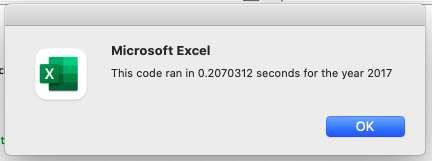
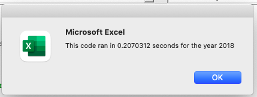

# Stock Analysis

## Overview of Project
### Purpose 
The purpose of the following project is to analyze stock data using VBA. We are conducting this research to help out a recent graduate, Steve, who has been tasked by his parents to see which stocks are the best to invest in based on two factors, their total volumes and percent return. Initially this analysis was created to comb through 12 stocks but now we are refactoring the code to loop through all data at once so that we are able to run through our data faster. This will allow the code to run more efficiently as well as allow for the possibility to run an analysis on hundreds or thousands of stocks if we so choose. 

## Results
### Stock Performance Between 2017 and 2018
Both the original and refactored script led to the same results in regards to yearly volume and percent return. The first item that was tested for in the stocks for both years was the total volume. The total volume refers to how often stock is traded throughout the year. The more often a stock is traded, the more that you can see the price being accurate. When looking at the outcomes of total volumes for both years it can be seen that with the exception of a couple of stocks, the total volume tended to be much higher in 2018 which goes to show that the stock was being traded more. In order to find the total volume, I used the following line of code where we added the value of the cells in column 8 together if they had matching ticker indexes. 
'''

     '3a) Increase volume for current ticker
     'We can get rid of the if statement that we had here earlier, for each volume of the ticker index type we add it together.
     tickerVolumes(tickerIndex) = tickerVolumes(tickerIndex) + Cells(i, 8).Value
     
 '''
 
Percent return refers to how much an investment grew or shrank throughout the course of the year. Looking at the results of the data we can see that 2017 had significantly higher yearly returns than 2018. Only one stock shrank throughout the course of 2017 whereas all but two shrank in 2018. However, since the stock was traded more in 2018 this could mean that the prices are better represented during the course of this year even though the stocks tended to shrink. Looking at this data it seems like ENPH and RUN tickers would be good stocks to invest in as they both increased in their volumes and returns from 2017 to 2018. They also both were the only tickers to have return growth both years. 

In order to find the percent return I used the following code in the refactored script: 

'''

    '3b) Check if the current row is the first row with the selected tickerIndex.
    'Starting prices and ending prices if statements are the same as before but change variables and add in the tickerIndex for referencing which index we are on.
     If Cells(i - 1, 1).Value <> tickers(tickerIndex) And Cells(i, 1).Value = tickers(tickerIndex) Then
         tickerStartingPrices(tickerIndex) = Cells(i, 6).Value
     End If

     '3c) Check if the current row is the last row with the selected ticker.
     'If the next row's ticker doesn't match, increase the tickerIndex.
     If Cells(i + 1, 1).Value <> tickers(tickerIndex) And Cells(i, 1).Value = tickers(tickerIndex) Then
         tickerEndingPrices(tickerIndex) = Cells(i, 6).Value
         
'''

As seen above, I used two if statements in order to test for starting and ending prices. If the ticker in the row prior and the current ticker did not match, then the price column associated with the current ticker was recorded as the starting price. Similarly, if the current ticker did not match the ticker of the following row, then the price value associated with the current ticker was marked as the ending price. 

### Original Script vs. Refactored Script
-compare execution times of the two different scripts using the images
In the original script we were looping through each index separately and then testing for the next one, in our refactored script we are looping through all at once, This improves efficiency. 

The original script and refactored script give the same end result in the long run in terms of the data found, however the refactored script made a few changes in order to improve the code efficiency. In the original script, I created a for loop to record the total volume, starting, and ending prices for one ticker at a time. When all calculations had been completed the ticker would increase by one and the loop would repeat until all tickers were used. This gave us the correct answers but there is a more efficient was to structure our code. In the refactored code we are checking for all tickers volume, starting, and ending prices within the same loop. The way this is completed is by creating three output arrays for these values: 

'''

    '1b) Create three output arrays
    'This is so that we can scan through the data all at once as opposed to starting over each time.
    Dim tickerVolumes(12) As Long
    Dim tickerStartingPrices(12) As Single
    Dim tickerEndingPrices(12) As Single
    
'''
By doing this we are able to refering all tickers within the same loop. A few other changes must be made to account for this adjustment such as referencing the ticker indexes when using these arrays (i.e. instead of using tickerVolume, using tickerVolumes(tickerIndex). Also, within the end of our loop we must also create a statement to increase our ticker index.

'''

     '3d) Increase the tickerIndex.
     'We do not need another if statement, this can just be tacked onto the end the if statement from above since they need the same requirements.
         tickerIndex = tickerIndex + 1
'''
By making these changes, as well as others seen in the refactored script in the xlsm file, we are able to run through all tickers in one loop which increases efficiency and decreases run time. In the original script, when I ran the 2017 macro it took 0.8359375 seconds, the refactored script allowed for this time to be cut down to 0.2070312 seconds. 

Similarly, when running the original script for 2018 the run time was 0.84375 seconds and the refactored script ran the 2018 script in 0.2070312 seconds. 

## Summary
### What are the advantages or disadvantages of refactoring code?
-advantage- it runs faster, it can run for more stocks because it's more generalized, it makes it cleaner and more efficient 
-disadvantages, it can add in bugs that were not there before, you're taking a stable code and messing with it.
### How do these pros and cons apply to refactoring the original VBA script?
- refactoring it made it run quite a bit faster which means we could analyze thousands of things if we wanted to. It made it more efficient and the tickerIndex generalized many items. However it took quite a bit of time to refactor. In a company this may take time that that is not there to refactor working code. Also it was important to save a copy of the old code because since we were messing with it we didn't want to introduce bugs or problems that made it then unsuable.
